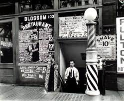
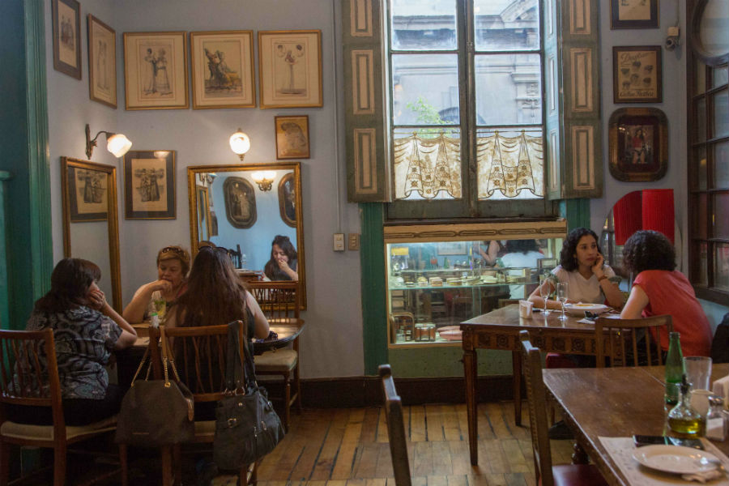

<!DOCTYPE html>
<html>
    <head>
        <meta charset="utf-8">
        <link rel="stylesheet" href="estilos.css" type="text/css" />
		<title> El rincón de Paco </title>
        
    </head>
    <body>
	<header>
		<h1> El rincón de Paco </h1>
		<nav>
			<ul>
			<li> <a href="Menu.html"> Mira nuestro menú </a> </li>
			<li> <a href="reserva.html"> Reserva tu mesa ahora </a> </li>
			</ul>
		</nav>
	</header>
	        
	

		<h1> Nuestra historia </h1>
		
 Desde 1542 llevamos sirviendo las mejores tapas en el centro de Toledo y con la mejor atención a nuestros clientes.

		
 Entre 1698 y 1723 conseguimos el titulo al mejor servicio de Toledo, premio que volvimos a conseguir entre 1800 y 1843 

		
 También hemos conseguido grandes premios de gastronomia como la mejor tortilla de patata en todo toledo en diversos años y las mejores croquetas de todo Castilla la Mancha, premio del que somos actuales ganadares.
 
		
 Desde que nuestro antepasado Francisco José García Molina más conocido como Paco fundara el restaurante, estomo muy orgullos de lo que hemos conseguido. 

		
		
 Lo que antes fue una vieja peluquería, nosotros lo transformamos en un restaurante de éxito que ha podido luchar contra el tiempo 

		
 Nuestro pequeño local ha dado de comer a grandes personas como Carlos III de España y V de Almania, Napoleón Bonaparte, Francisco Franco, Pedro Sanchez, y muchos más. 

		
 Hoy día nuestro objetivo es seguir siendo ese pequeño negocio de confianza, con ricos plato y que la gente quiera volver. 

		
		
 Te esperamos en la Av. de CarlosIII nº13, aquí en Toledo 

	

		
        
        
    </body>
</html>
